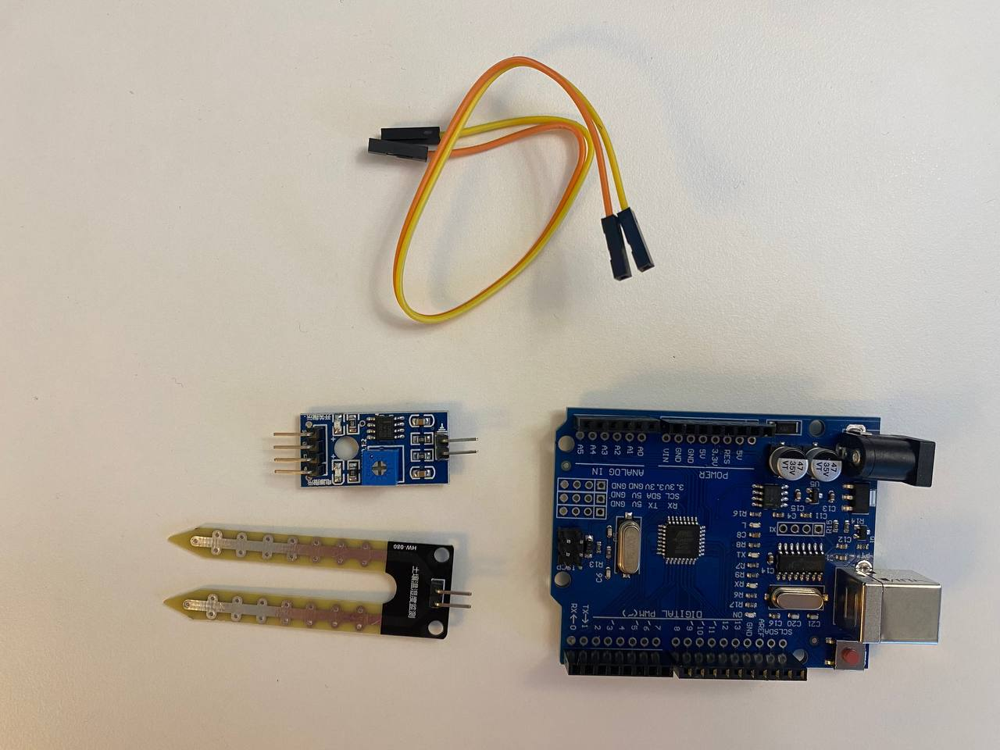
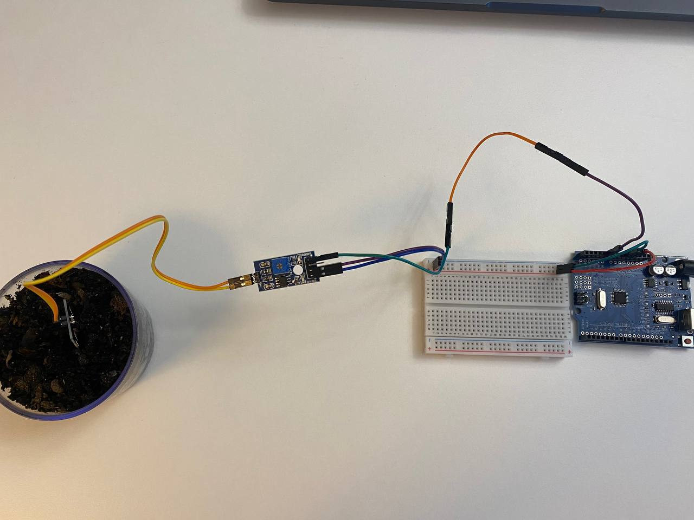
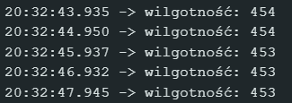

 
 
# Krok 1 - Czujnik wilgotności gleby

W pierwszym kroku po prostu podłączymy czujnik wilgotności gleby do Arduino i wyświetlimy dane w Serial Monitor.

## Wymagane elementy

- Arduino UNO
- Czujnik wilgotności gleby
- Przewody połączeniowe
- Kabel USB

## Schemat połączenia

| Czujnik | Arduino |
|---|---|
| VCC | 5V |
| GND | GND |
| AO | A0 |

## Kod

Odpowiedni kod znajduje się w [src/step_01](./../src/step_01/step_01.ino).

## Wynik

Otwórz `Serial Monitor` w Arduino IDE.

Powinieneś zobaczyć wartości podobne do tych:

- sucho → `800–1023`
- wilgotno → `300–700`
- w wodzie → około `0–300`

Wartości mogą się różnić w zależności od czujnika i rodzaju gleby!

Przykład:

 