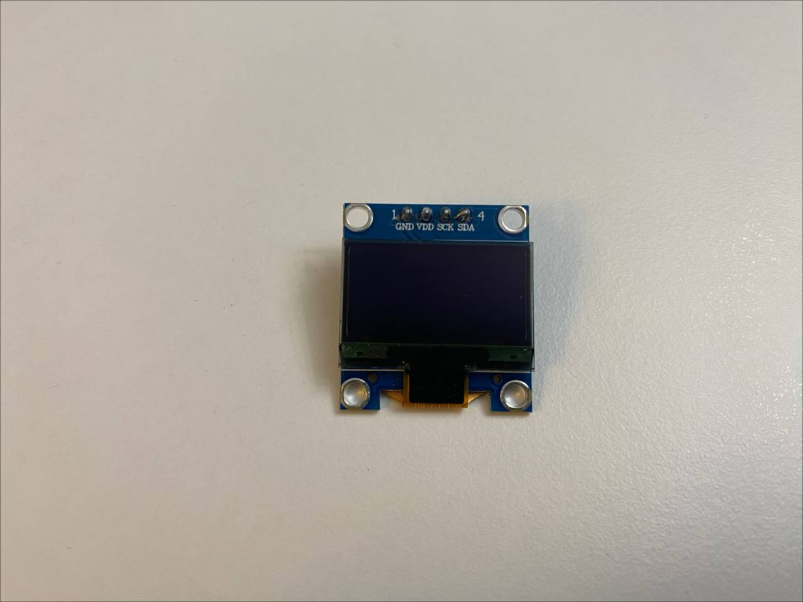
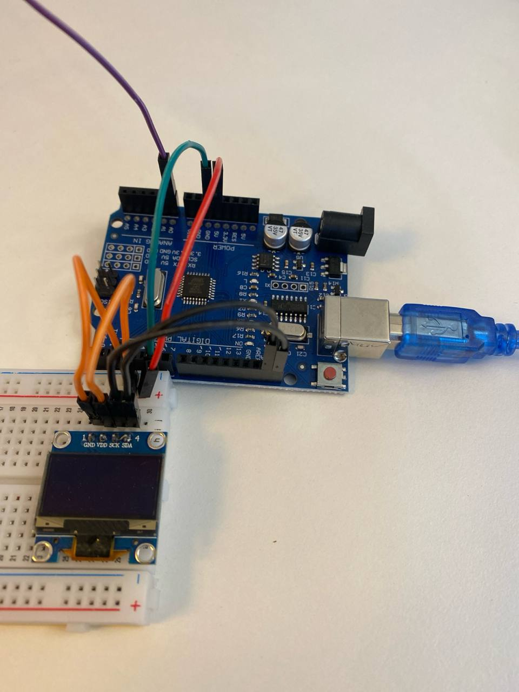
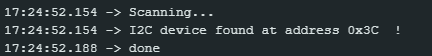
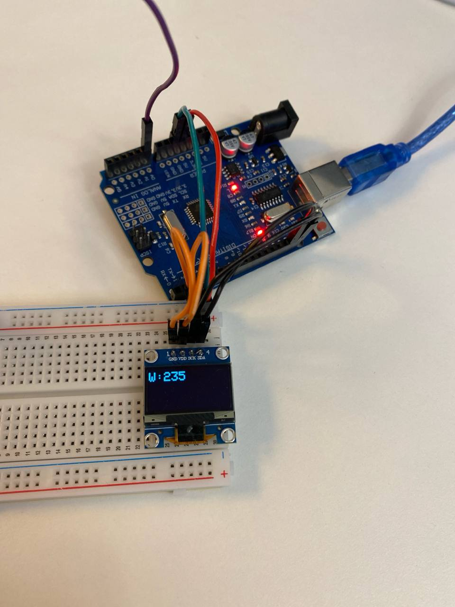

# Krok 2 - Wyświetlacz OLED

W drugim kroku podłączymy wyświetlacz OLED do Arduino i pokażemy na nim wartości wilgotności gleby.

Porzebien będzie krok 1.

## Wymagane elementy

- Arduino UNO
- Czujnik wilgotności gleby
- Wyświetlacz OLED (I2C)
- Przewody połączeniowe
- Kabel USB



## Schemat połączenia

### Czujnik wilgotności gleby

| Czujnik | Arduino |
|---|---|
| VCC | 5V |
| GND | GND |
| AO | A0 |

### OLED SSD1306 (I2C)

| OLED | Arduino UNO |
|---|---|
| VCC | 5V |
| GND | GND |
| SCK | SCL |
| SDA | SDA |



## Kod

### Biblioteki

Do działania programu trzeba dodać bibliotekę `Adafruit SSD1306`.


### Adres OLED

Aby poprawnie skonfigurować wyświetlacz OLED w kodzie, najpierw musimy znaleźć jego adres I2C.
W tym celu uruchom przykład znajdujący się w Arduino IDE:

```text
File -> Examples -> Wire -> i2c_scanner
```
Po uruchomieniu programu otwórz Serial Monitor. Powinieneś zobaczyć komunikat podobny do tego na obrazku poniżej.
W tym przypadku adres wyświetlacza OLED to `0x3C`. Zapamiętaj tę wartość, będzie potrzebna w kodzie programu.





### Kod dla uruchomienia

Odpowiedni kod znajduje się w [src/step_02](./../src/step_02/step_02.ino). W kodzie korzystamy z adresu OLED, który był znaleziony w poprzednim kroku.

## Wynik

Po uruchomieniu programu wartości wilgotności gleby będą wyświetlane na ekranie OLED.

Przykład:



## Uwagi

Jeśli ekran OLED pozostaje pusty:

- sprawdź połączenia SDA i SCL
- upewnij się, że zainstalowana jest biblioteka `Adafruit SSD1306`
- sprawdź adres I2C wyświetlacza
