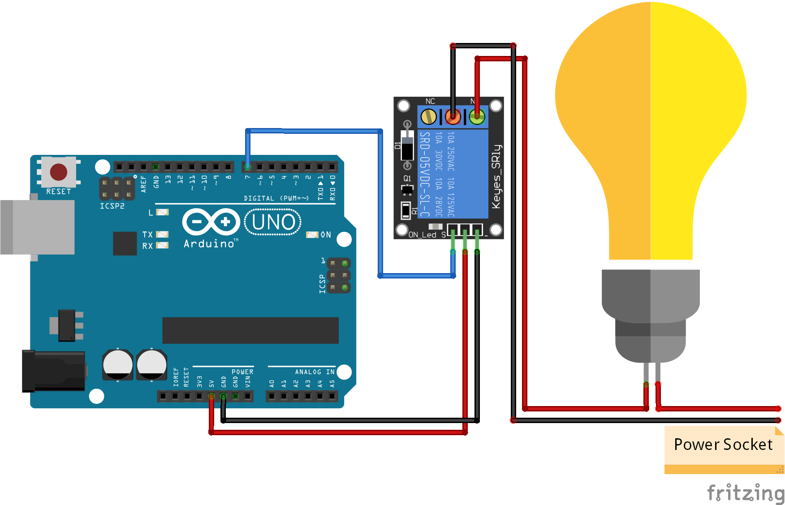
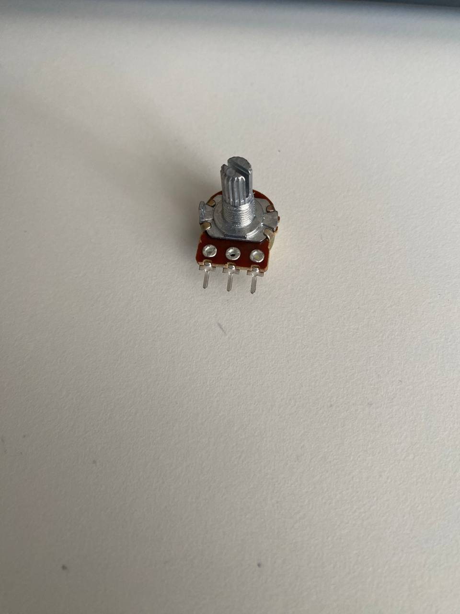
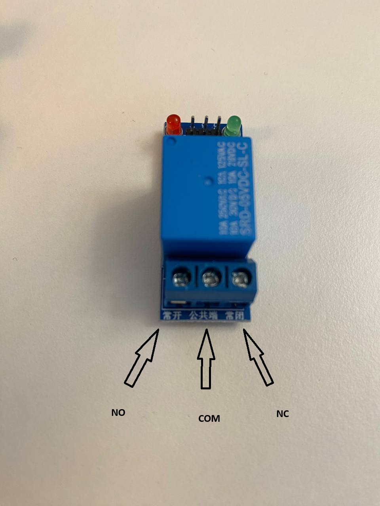
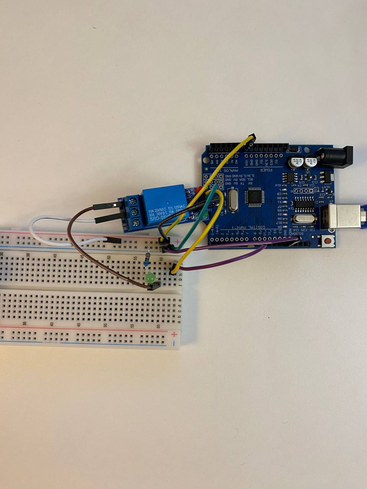

# Krok 3 - Moduł przekaźnika dla diody LED

W przyszłości chcemy podłączyć pompkę do automatycznego podlewania roślin.  
Do sterowania pompką potrzebny będzie moduł przekaźnika (relay module).
Zanim jednak podłączymy prawdziwą pompkę, najpierw nauczymy się obsługi przekaźnika na prostym i bezpiecznym przykładzie: będziemy sterować diodą LED.

## Co to jest przekaźnik?

Przekaźnik działa jak elektroniczny przełącznik.

Arduino może wysłać sygnał do przekaźnika, a przekaźnik włączy lub wyłączy podłączone urządzenie.

Dzięki temu możemy sterować urządzeniami wymagającymi większego prądu niż może dostarczyć Arduino.

## Wymagane elementy

- Arduino UNO
- Moduł przekaźnika 5V
- Dioda LED
- Rezystor 330Ω
- Przewody połączeniowe
- Kabel USB

## Schemat połączenia

### Piny przekaźnika

Przekaźnik ma część wejściową oraz wyjściową.

Na wejściu znajdują się znane już piny:

- `IN` — sygnał sterujący z Arduino
- `GND` — masa
- `VCC` — zasilanie 5V

W tym projekcie używamy pinu `D7` Arduino do sterowania przekaźnikiem.
 

Po drugiej stronie modułu znajdują się trzy złącza:

- `NO` — Normally Open (normalnie otwarte)
- `COM` — Common (wspólny)
- `NC` — Normally Closed (normalnie zamknięte)

Na niektórych modułach (jak tutaj u nas) można również zobaczyć chińskie oznaczenia:

- `常开` = `NO` (obok czerwonej diody LED)
- `公共` = `COM` (środkowy pin)
- `常闭` = `NC` (obok zielonej diody LED)

Wejścia przekaźnika:

| Relay | Arduino |
|---|---|
| VCC | 5V |
| GND | GND |
| IN | D7 |

Wyjścia przekaźnika:

| Element | Połączenie |
|---|---|
| COM | 5V |
| NO | Anoda LED | 

Zatym katodą LED lączymy do rezystor 330Ω, a zatym do GND.

## Jak to działa?

Po uruchomieniu programu Arduino będzie co sekundę włączać i  wyłączać przekaźnik.

Gdy przekaźnik zostanie aktywowany, dioda LED zapali się.

## Kod programu

Odpowiedni kod znajduje się w [src/step_03](./../src/step_03/step_03.ino).

## Wynik

Po uruchomieniu programu:

- przekaźnik będzie wydawał charakterystyczne kliknięcie
- dioda LED będzie migać co sekundę

Przykład:

<video src="./images/step-03-result.mp4" controls width="300"></video>

## Uwagi

- Niektóre moduły przekaźników działają odwrotnie:
  - `LOW` = włączony
  - `HIGH` = wyłączony
- Jeśli LED świeci cały czas, spróbuj odwrócić logikę w kodzie
- W następnym kroku zamiast diody LED podłączymy pompkę wody
- Jeśli przekaźnik działa niestabilnie, sprobuj użyć tranzystora z kroku 3a
 