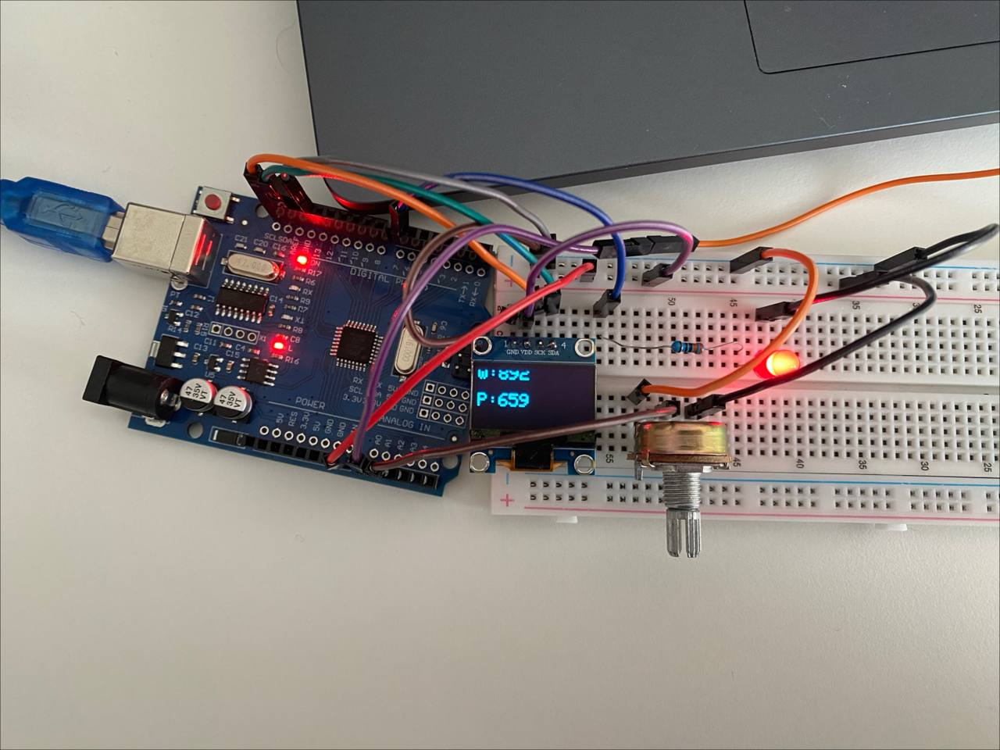

# Krok 3 - Próg wilgotności i potencjometr

W tym kroku dodamy próg wilgotności gleby.

Jeśli gleba będzie zbyt sucha, zapali się dioda LED informująca, że roślina wymaga podlania.

Dodatkowo podłączymy potencjometr, dzięki któremu będzie można zmieniać wartość progu bez modyfikowania kodu.

Potrzebny będzie krok 2.

## Wymagane elementy

- Arduino UNO
- Czujnik wilgotności gleby
- Wyświetlacz OLED (I2C)
- Potencjometr
- Dioda LED
- Rezystor 220Ω
- Przewody połączeniowe
- Kabel USB 

## Schemat połączenia

### Czujnik wilgotności gleby

| Czujnik | Arduino |
|---|---|
| VCC | 5V |
| GND | GND |
| AO | A0 |

### Potencjometr

Potencjometr ma trzy nóżki. Najważniejsza jest środkowa nóżka SIG, bo to właśnie z niej Arduino odczytuje wartość. Dlatego najpierw podłącz ją do pinu `A1`.

Dwie pozostałe nóżki należy podłączyć do `5V` oraz `GND`.

Kolejność nie ma większego znaczenia. Jeśli podłączysz je odwrotnie, potencjometr nadal będzie działał, zmieni się jedynie kierunek regulacji:
 

| Potencjometr | Arduino |
|---|---|
| VCC | 5V |
| GND | GND |
| SIG | A1 |

### Dioda LED

| LED | Arduino |
|---|---|
| Anoda (+) | D7 |
| Katoda (-) | Rezystor 220Ω → GND |

## Jak to działa?

Arduino odczytuje:

- aktualną wilgotność gleby z czujnika
- wartość potencjometru

Wartość potencjometru jest traktowana jako próg wilgotności.

Jeżeli odczyt z czujnika przekroczy ustawiony próg, dioda LED zostanie włączona.

W przeciwnym przypadku dioda pozostanie wyłączona.

## Kod

Odpowiedni kod znajduje się w [src/step_03](./../src/step_03/step_03.ino).

## Wynik

Po uruchomieniu programu:

- obracanie potencjometru zmienia próg wilgotności
- gdy gleba staje się zbyt sucha, zapala się dioda LED
- gdy wilgotność wróci powyżej progu, dioda gaśnie

Przykład:

## Uwagi

- Potencjometr pozwala regulować próg bez zmiany kodu.
- Zakres wartości zależy od używanego czujnika.