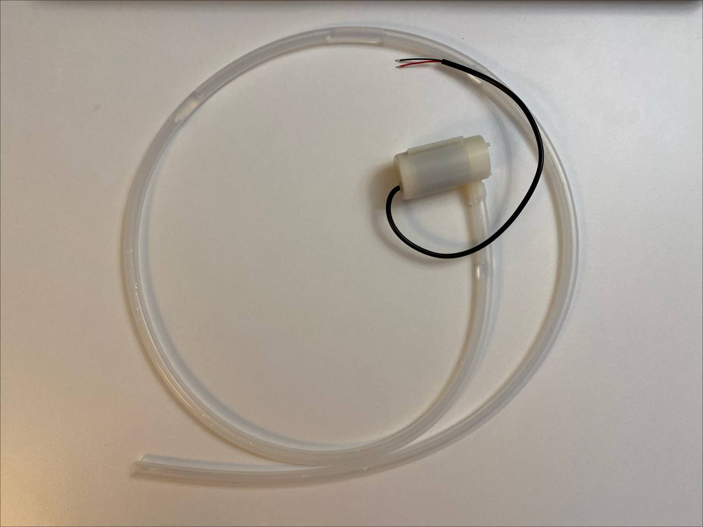

# Krok 4 - Podłączenie pompki wody

W poprzednim kroku nauczyliśmy się sterować przekaźnikiem przy pomocy diody LED.

Teraz zamiast diody podłączymy prawdziwą pompkę wody, która będzie używana do automatycznego podlewania roślin.

## Pompka wody

Pompka jest bardzo prosta w obsłudze.

Posiada dwa przewody:

- czerwony — zasilanie `5V`
- czarny — `GND`

Po podłączeniu zasilania pompka zaczyna pracować i pompuje wodę.

## Dlaczego potrzebujemy przekaźnika?

Nie chcemy, aby pompka działała cały czas.

Dlatego podłączymy ją przez przekaźnik, dzięki czemu Arduino będzie mogło:

- włączać pompkę
- wyłączać pompkę

W praktyce wykorzystamy dokładnie to samo połączenie, które stworzyliśmy w kroku 3.  
Jedyna różnica polega na tym, że zamiast diody LED podłączymy pompkę.

## Wymagane elementy

- Arduino UNO
- Moduł przekaźnika 5V
- Pompka wody 5V
- Przewody połączeniowe
- Kabel USB

## Schemat połączenia

Wejścia przekaźnika:

| Relay | Arduino |
|---|---|
| VCC | 5V |
| GND | GND |
| IN | D13 |

Wyjścia przekaźnika:

| Element | Połączenie |
|---|---|
| COM | 5V |
| NO | czerwony przewód pompki |
 
Zatym czarny przewód pompki podlączamy do GND.

## Jak to działa?

Po uruchomieniu programu Arduino będzie co kilka sekund:

- włączać pompkę
- wyłączać pompkę

Gdy przekaźnik zostanie aktywowany, pompka zacznie pompować wodę.

## Kod programu

Odpowiedni kod znajduje się w [src/step_05](./../src/step_05/step_05.ino).

## Wynik

Po uruchomieniu programu:

- przekaźnik będzie klikał
- pompka będzie okresowo się uruchamiać

Przykład:

<video src="./images/step-05-result.MOV" controls width="350"></video>

## Uwagi

- Nigdy nie uruchamiaj pompki bez wody na dłuższy czas
- Jeśli pompka nie działa:
  - sprawdź zasilanie 5V
  - sprawdź połączenia przekaźnika
  - upewnij się, że przekaźnik się aktywuje
