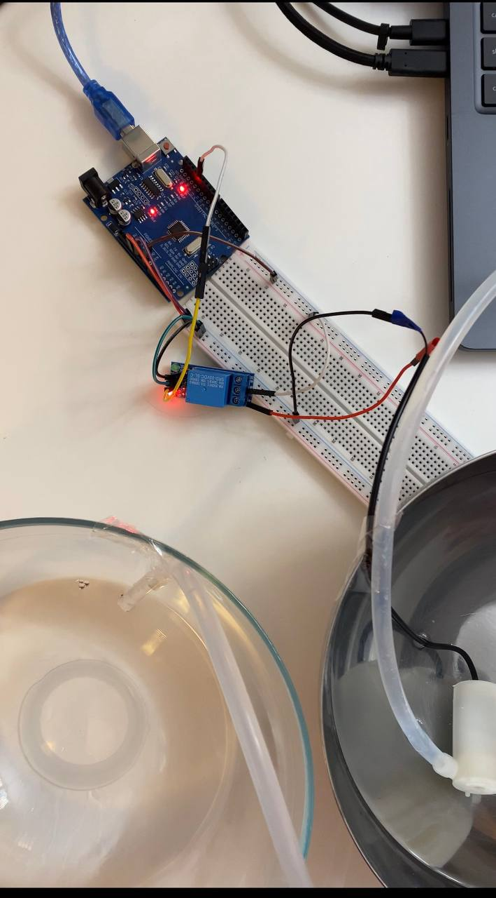

# Krok 5 - Sterowanie pompką przyciskiem

W poprzednim kroku nauczyliśmy się sterować pompką przy pomocy przekaźnika.

Teraz dodamy przycisk, dzięki któremu będzie można ręcznie uruchomić pompkę.

Po naciśnięciu przycisku pompka włączy się na 3 sekundy, a następnie automatycznie się wyłączy.

## Wymagane elementy

- Arduino UNO
- Moduł przekaźnika 5V
- Pompka wody 5V
- Przycisk
- Przewody połączeniowe
- Kabel USB

## Schemat połączenia

Wejścia przekaźnika:

| Relay | Arduino |
|---|---|
| VCC | 5V |
| GND | GND |
| IN | D13 |

Wyjścia przekaźnika:

| Element | Połączenie |
|---|---|
| COM | 5V |
| NO | czerwony przewód pompki |
 
Zatym czarny przewód pompki podlączamy do GND.

### Przekaźnik → Arduino

| Relay | Arduino |
|---|---|
| VCC | 5V |
| GND | GND |
| IN | D7 |

### Przycisk → Arduino

| Przycisk | Arduino |
|---|---|
| Pin 1 | D2 |
| Pin 2 | GND |

### Pompka → Przekaźnik

| Pompka | Połączenie |
|---|---|
| czerwony przewód | NO |
| czarny przewód | GND |

### Zasilanie

| Element | Połączenie |
|---|---|
| COM | 5V |

## Jak to działa?

Program cały czas sprawdza stan przycisku.

Jeśli przycisk zostanie naciśnięty:

1. przekaźnik zostanie aktywowany
2. pompka uruchomi się na 3 sekundy
3. pompka automatycznie się wyłączy

## Kod programu

Odpowiedni kod znajduje się w [src/step_05](./../src/step_05/step_05.ino).

## Wynik

Po naciśnięciu przycisku:

- usłyszysz kliknięcie przekaźnika
- pompka zacznie działać
- po 3 sekundach pompka wyłączy się automatycznie

Przykład:

<video src="./images/step-05-result.mp4" controls width="350"></video>

## Uwagi

- W tym przykładzie używamy `INPUT_PULLUP`
- Oznacza to, że:
  - przycisk zwiera pin do `GND`
  - stan `LOW` oznacza wciśnięty przycisk
- Jeśli pompka uruchamia się sama:
  - sprawdź połączenie przycisku
  - upewnij się, że przycisk jest podłączony do `GND`